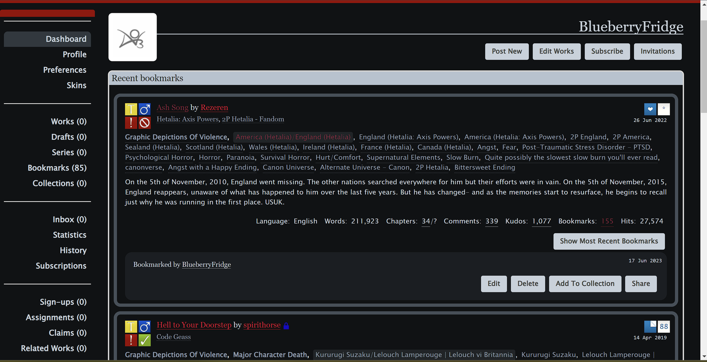

# AO3 Gunpowder Theme
A dark theme which can be used to save energy whilst reading. Some CSS elements have been tweaked to give the site a slightly modernised look.

## How to use
1. On the right panel, click on the latest release.
2. Download and extract the ZIP file.
3. Log in to your account on [Archive of Our Own](https://archiveofourown.org/).
4. Go to your Profile Dashboard -- Click on your profile name on the upper right corner > __Dashboard__.
5. On the left side panel of your __Dashboard__, click on Skins.
6. Click on __Create Site Skin__.
7. Fill out the __About__ section:

    a. Type: Site Skin

    b. Title: _\<Your Title\>_ 

    c. Description: _\<Your Description\>_ 

    d. The rest of the fields are optional. You may fill it out if it pleases you.

8. Copy the CSS from `gunpowder-theme.css` in the folder you have extracted in __2__.

9. Go back to the __Create Site Skin__ page. Under the __CSS__ section, paste the CSS into the text area.

10. Scroll down and click the __Submit__ button.

## Preview
### Home Page

### Works Page

### Work Page

### Dashboard

## Note
Some styles have been left alone. They may be improved sometime in the future.
